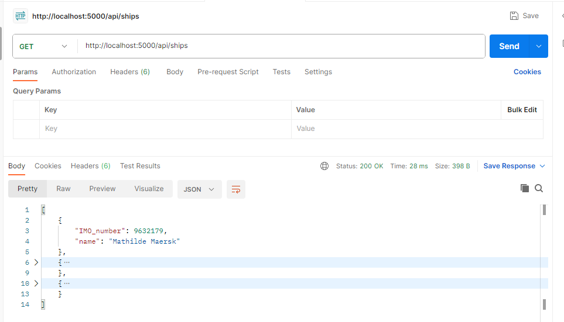
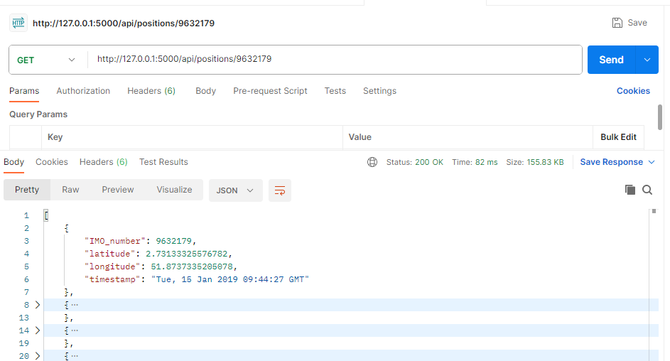
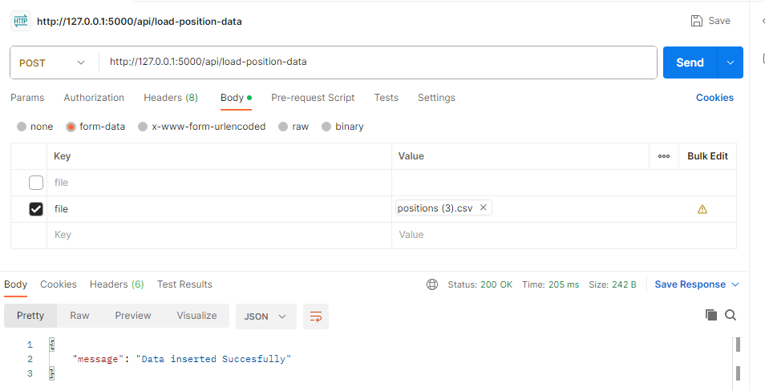
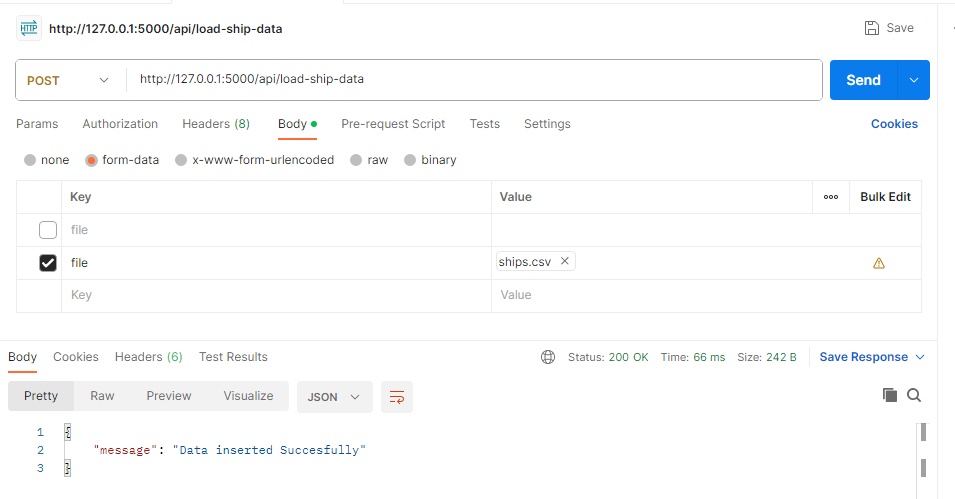

## Application Setup
1. Install Python (3.12) 
2. Clone this repo, cd to ship-tracker-api
3. Create and activate virtual environment
    
    Run below commands in cmd/terminal:

    `python -m venv vevn`

    `venv\Scripts\activate`

4. Install required packages

    `pip install -r requirements.txt`

5. Run Flask App

    `python app.py`

6. Application will start running on http://127.0.0.1:5000,
    it will automatically create a sqlite database and data into tables.

7. Open index.html in browser, You can see a traces of ship.

    To see map properly, please generate (https://account.mapbox.com/auth/signup/) and add mapboxAccessToken in index.html file
`var mapboxAccessToken = '<add-token-here>'` line num:33;

## APIs
1. [GET]  http://localhost:5000/api/ships
2. [GET]  http://127.0.0.1:5000/api/positions/9632179
    
    9632179 is an IMO_number of ship

3. [POST] http://127.0.0.1:5000/api/load-position-data
    Upload a ship position data csv file, it will insert data from file into database.

    CSV file must have a 4 columns in order -   'IMO_number', 'timestamp', 'longitude', 'latitude'. without header.
    

4. [POST] http://127.0.0.1:5000/api/load-ship-data
    Upload a ship data csv file, it will insert data from file into database

## Testing with Pytest
run
`python -m pytest` or `python -m pytest tests --disable-warnings `

## Testing with postman or curl
1. `curl --location 'http://127.0.0.1:5000/api/load-position-data' \
--form 'file=@"<path_to_csv_file>"'`

2. `curl --location 'http://127.0.0.1:5000/api/load-ship-data' \
--form 'file=@"<path_to_csv_file>"'`
    eg: `curl --location 'http://127.0.0.1:5000/api/load-ship-data' \
--form 'file=@"/E:/Downloads/ships.csv"'`

3. `curl --location 'http://localhost:5000/api/ships'`

4. `curl --location 'http://127.0.0.1:5000/api/positions/9632179'`

## Results
1. [GET]  http://localhost:5000/api/ships
    
2. [GET]  http://127.0.0.1:5000/api/positions/IMO_number
    

3. [POST] http://127.0.0.1:5000/api/load-position-data
    

4. [POST] http://127.0.0.1:5000/api/load-ship-data
    

## Docker

1. Build docker image
    `docker build --tag ship-app .`

2. View images
    `docker images`

3. Run docker image
    `docker run -d -p 5000:5000 ship-app`
    Application will start, Hit  http://localhost:5000/api/ships to check.

4. See running container
    `docker ps`

5. To stop docker container
    `docker stop <container_id>`